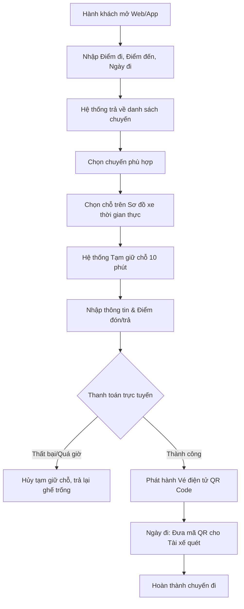

# BRD — Tài liệu Yêu cầu Nghiệp vụ

## (Business Requirements Document)

> Dự án: Ứng dụng đặt vé xe khách trực tuyến "Pam Travel"

---

## Thông tin tài liệu

| Thông tin | Chi tiết |
|---|---|
| **Dự án** | Ứng dụng tìm kiếm chuyến, chọn chỗ và đặt vé xe khách trực tuyến |
| **Phiên bản** | 1.0 (Bản thảo khởi tạo) |
| **Ngày cập nhật** | 04/06/2026 |
| **Người yêu cầu** | Product Owner / Ban Giám Đốc |
| **Người tiếp nhận** | Dev Team |

---

## 1. Bối cảnh

Phương thức đặt vé xe khách truyền thống (gọi điện thoại qua tổng đài hoặc mua trực tiếp tại bến) đang lộ rõ nhiều bất cập đối với cả hành khách và nhà xe:

- **Với hành khách:** Khó khăn trong việc tra cứu lịch trình, không được tự do chọn chỗ ngồi ưng ý, dễ xảy ra tình trạng nhầm lẫn vé hoặc mất vé giấy, rủi ro mang nhiều tiền mặt.
- **Với nhà xe:** Quản lý chỗ trống bằng sổ sách/Excel dễ dẫn đến tình trạng "overbooking" (bán trùng ghế), khó kiểm soát doanh thu, tốn nhiều nhân lực trực tổng đài.

Hệ thống "Pam Travel" được phát triển nhằm số hóa toàn bộ quy trình này trên nền tảng di động (dành cho hành khách) và Web/App quản lý (dành cho nhà xe). Ứng dụng cung cấp trải nghiệm tìm kiếm chuyến đi trực quan, chọn ghế thời gian thực, thanh toán trực tuyến và sử dụng vé điện tử (QR Code).

---

## 2. Mục tiêu nghiệp vụ

| Mã | Mục tiêu | Độ ưu tiên | Trạng thái dự kiến |
|----|---------|-----------|-------------------|
| BO-01 | Tìm kiếm và lọc chuyến xe theo điểm đi, điểm đến, ngày giờ | Cao | MVP |
| BO-02 | Xem sơ đồ xe và chọn chỗ ngồi theo thời gian thực (Real-time) | Cao | MVP |
| BO-03 | Tích hợp cổng thanh toán trực tuyến (VNPay/Momo) | Cao | MVP |
| BO-04 | Quản lý vé điện tử (E-ticket) bằng mã QR | Cao | MVP |
| BO-05 | Xây dựng tính năng Hủy vé và Hoàn tiền tự động | Trung bình | Giai đoạn 2 |
| BO-06 | Dashboard cho Nhà xe quản lý chuyến, sơ đồ khách và soát vé | Cao | MVP |
| BO-07 | Hệ thống tích điểm thành viên và đánh giá chuyến đi | Thấp | Giai đoạn 3 |

---

## 3. Phạm vi dự án

### 3.1. Trong phạm vi (In-scope)

- **Xác thực người dùng (Authentication)**:
  - Đăng ký/Đăng nhập bằng Số điện thoại (Xác thực OTP qua SMS/Zalo).
  - Đăng nhập bằng tài khoản Google/Apple.
  - Phân quyền: User (Hành khách), Driver (Tài xế/Soát vé), Admin (Quản trị hệ thống).

- **Tìm kiếm & Chọn chuyến**:
  - Tìm kiếm chuyến xe dựa trên Tỉnh/Thành phố đi, Tỉnh/Thành phố đến và Ngày khởi hành.
  - Bộ lọc: Khung giờ đi, Loại xe (Limousine, Giường nằm, Ghế ngồi), Giá vé, Nhà xe.
  - Sắp xếp: Giá thấp đến cao, Giờ khởi hành sớm nhất.

- **Quy trình đặt vé (Booking Flow)**:
  - Hiển thị sơ đồ ghế/giường trống thời gian thực theo cấu hình của từng loại xe.
  - Chọn chỗ ngồi (Tối đa 5 chỗ/lần đặt).
  - Điền thông tin hành khách (Tên, SĐT, Điểm đón, Điểm trả).
  - Tạm giữ chỗ (Seat Locking) trong vòng 10 phút để thực hiện thanh toán.

- **Thanh toán & Vé điện tử**:
  - Hỗ trợ thanh toán qua Cổng thanh toán (VNPay, Momo) hoặc Thẻ tín dụng.
  - Sinh mã QR vé điện tử (E-ticket) sau khi thanh toán thành công.
  - Quản lý danh sách vé: Sắp đi, Lịch sử chuyến, Đã hủy.

- **Dành cho Nhà xe / Tài xế (Operator App/Web)**:
  - Quản lý danh sách chuyến xe (Tạo chuyến, Đóng/Mở chuyến).
  - Quét mã QR của hành khách để "Check-in" khi lên xe.
  - Xem danh sách hành khách thu gọn (Manifest) kèm điểm đón/trả để chủ động gọi điện.

- **Hệ thống đánh giá**:
  - Người dùng có thể đánh giá chuyến đi (1-5 sao) và để lại bình luận sau khi chuyến đi kết thúc.

### 3.2. Ngoài phạm vi (Out-of-scope)

- Bán vé liên vận quốc tế.
- Tích hợp đặt phòng khách sạn, thuê xe máy đi kèm (Cross-selling).
- Định vị GPS xe khách thời gian thực trên bản đồ (Live Tracking) cho phiên bản MVP.
- Tính năng chat trực tiếp giữa Hành khách và Tài xế (Sử dụng gọi điện thoại truyền thống qua API che số).
- Cơ chế giá linh hoạt (Dynamic Pricing - tự động tăng giá dịp lễ tết bằng AI).

---

## 4. Quy trình nghiệp vụ hiện tại (As-Is)

Hành khách có nhu cầu đi lại → Tìm số điện thoại nhà xe trên mạng → Gọi điện hỏi lịch trình và chỗ trống → Nhân viên trực tổng đài kiểm tra sổ sách/Excel → Chốt chỗ bằng miệng → Hành khách ra bến xe trước 30-60 phút để lấy vé giấy và thanh toán tiền mặt → Lên xe.

**Vấn đề:** Mất thời gian, nguy cơ nhà xe quên ghi sổ dẫn đến mất chỗ, hành khách không biết trước vị trí ngồi.

---

## 5. Quy trình nghiệp vụ mong muốn (To-Be)

---

## 6. Quy tắc nghiệp vụ

| Mã | Quy tắc | Mô tả chi tiết |
|----|---------|---------------|
| BR-01 | Tạm giữ chỗ (Seat Lock) | Khi người dùng chọn ghế và chuyển sang màn hình thanh toán, ghế đó sẽ chuyển trạng thái "Đang giữ" (Locked) tối đa 10 phút. Quá 10 phút không thanh toán, ghế tự động nhả về trạng thái "Trống". |
| BR-02 | Giới hạn số lượng vé | Mỗi tài khoản chỉ được phép đặt tối đa 5 vé trong một lượt giao dịch để tránh đầu cơ vé. |
| BR-03 | Xung đột đặt chỗ (Concurrency) | Nếu 2 người dùng cùng chọn 1 ghế vào cùng 1 tích tắc, hệ thống sử dụng Database Transaction để đảm bảo người gửi request (nhấn nút Xác nhận) đầu tiên sẽ lấy được ghế, người thứ 2 nhận thông báo "Ghế vừa được đặt". |
| BR-04 | Chính sách hủy vé | - Hủy trước 24h: Hoàn 100% tiền.   - Hủy từ 12h - 24h: Hoàn 50% tiền.   - Hủy trước 12h: Không hỗ trợ hủy vé (Phí 100%). |
| BR-05 | Tính hợp lệ của Vé QR | Mã QR của vé chỉ có giá trị khi: Trạng thái vé là "Đã thanh toán", Mã QR khớp với hệ thống mã hóa bảo mật, và Ngày giờ chuyến xe là hợp lệ (Upcoming). Quét QR xong vé chuyển sang "Đã sử dụng". |
| BR-06 | Đóng nhận khách | Hệ thống tự động đóng bán vé đối với một chuyến xe trước giờ khởi hành 60 phút. |
| BR-07 | Đánh giá chuyến đi | Hành khách chỉ có thể đánh giá chuyến xe khi trạng thái của vé chuyển sang "Hoàn thành" (Completed). |

---

## 7. Các bên liên quan (Stakeholders)

| Vai trò | Mối quan tâm & Trách nhiệm |
|--------|--------------------------|
| **Hành khách (Passenger)** | Cần ứng dụng dễ dùng để tìm chuyến, mua vé an toàn, lưu trữ vé không sợ mất, và nhận hỗ trợ kịp thời. |
| **Nhà xe/Tài xế (Operator)** | Cần công cụ để quản lý số lượng ghế trống, danh sách đón khách chính xác, soát vé nhanh gọn chống gian lận. |
| **Kế toán hệ thống** | Cần theo dõi dòng tiền thanh toán trực tuyến, đối soát doanh thu với cổng thanh toán và các nhà xe định kỳ. |
| **Dev Team** | Đảm bảo hệ thống chịu tải tốt vào các dịp Lễ, Tết (Traffic tăng đột biến) và không xảy ra lỗi sai lệch dữ liệu thanh toán/ghế ngồi. |

---

## 8. Ràng buộc và giả định

### Ràng buộc:

- Dữ liệu sơ đồ ghế ngồi phải được cập nhật ngay lập tức (Real-time update) để tránh việc nhiều người dùng thấy ghế trống nhưng đặt thì báo lỗi.
- Việc hoàn tiền (Refund) khi khách hủy vé phải phụ thuộc vào API của đối tác cổng thanh toán (VNPay/Momo) và có thể mất từ 3-7 ngày làm việc để tiền về thẻ.

### Giả định:

- Hành khách có kết nối mạng 3G/4G/Wifi tại điểm lên xe để mở mã QR trên ứng dụng.
- Tài xế/Lơ xe được trang bị smartphone kết nối mạng để sử dụng ứng dụng soát vé.

---

## 9. Tiêu chí nghiệm thu (Acceptance Criteria)

| Mã | Tiêu chí | Phương thức kiểm tra |
|----|---------|-------------------|
| AC-01 | Tìm kiếm chuyến | Nhập điểm đi A, điểm đến B và ngày T. Hệ thống trả về danh sách các chuyến đúng tuyến A-B khởi hành vào ngày T, hiển thị đúng giá tiền và số ghế trống. |
| AC-02 | Tạm giữ ghế thành công | User A chọn ghế A1 chuyển sang thanh toán. User B ở máy khác mở sơ đồ xe lên sẽ thấy ghế A1 màu xám (Đang có người đặt) và không thể chọn. |
| AC-03 | Nhả ghế tự động | User A để màn hình thanh toán quá 10 phút. Hệ thống báo timeout. Ghế A1 trên toàn hệ thống lập tức nhả về trạng thái màu trắng (Trống). |
| AC-04 | Đặt vé & Thanh toán | Thực hiện thanh toán thành công qua Sandbox của VNPay/Momo. App sinh ra mã QR và lưu vào mục "Vé của tôi", gửi email xác nhận. |
| AC-05 | Soát vé QR | Dùng tài khoản Tài xế quét mã QR của khách. Báo xanh (Vé hợp lệ) → Đổi trạng thái vé thành "Đã lên xe". Quét lại lần 2 báo đỏ (Vé đã được sử dụng). |
| AC-06 | Hủy vé & Tính phí | Khách nhấn hủy vé trước chuyến đi 18 tiếng. Hệ thống báo phí hủy 50%, số tiền hoàn trả 50%. Nhấn xác nhận, ghế trên hệ thống chuyển thành Trống. |

---

## 10. Lộ trình phát triển dự kiến

### Giai đoạn 1 (MVP)
Hoàn thiện App Hành khách (Tìm chuyến, Chọn ghế, Thanh toán cơ bản), Web Admin quản lý nhà xe, App Tài xế soát vé.

### Giai đoạn 2 (Hoàn thiện quy trình & Thanh toán)
Cập nhật tính năng Hủy vé tự động, Đối soát dòng tiền, Gửi vé qua Zalo ZNS.

### Giai đoạn 3 (Loyalty & Reviews)
Ra mắt tính năng tích điểm đổi voucher, hệ thống đánh giá bằng sao và bình luận, tự động nhắc nhở lên xe qua Push Notification.

### Giai đoạn 4 (Mở rộng & Tối ưu)
Phân tích hành vi bằng AI đề xuất tuyến đường, cung cấp tính năng theo dõi vị trí xe chạy thời gian thực.

---

## Ghi chú

*Tài liệu này là bản nháp khởi tạo và có thể được cập nhật sau khi thảo luận với các bên liên quan.*